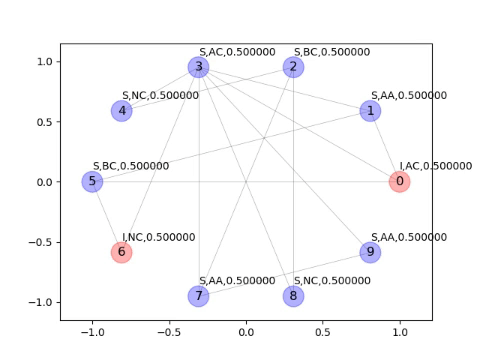

# An agent-based SIR-model for election dyanmics

## Simple illustration of an agent-based network and information spreading in it
 

## Information state, emotion state together affect one's final decision
 

## Incorporation of media news
